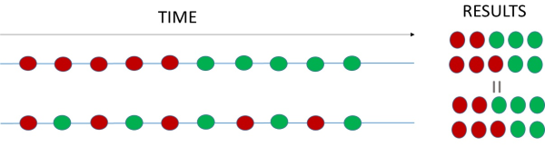
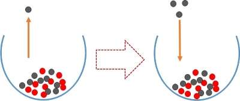
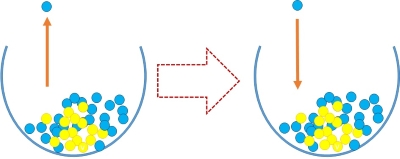
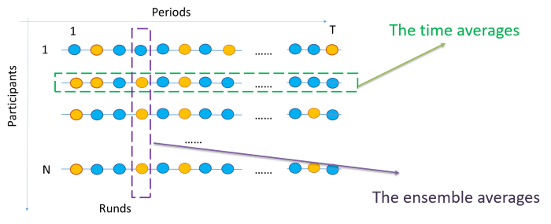
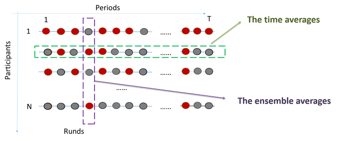
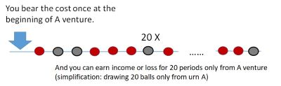
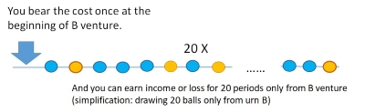
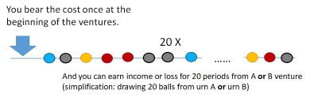

```{r echo = FALSE, warning = FALSE, error=FALSE, message=FALSE  }

#1.RUN ONCE BEFORE ############

################ START ############################################
###### Check, installation and loading of required packages #######
requiredPackages = c( "readr", "wesanderson", "flexdashboard","shiny", "corrplot", "psych","MASS", "diagram", "gt","tm","wordcloud") # list of required packages

for(i in requiredPackages){if(!require(i,character.only = TRUE)) install.packages(i)}
for(i in requiredPackages){if(!require(i,character.only = TRUE)) library(i,character.only = TRUE) } 

library("flexdashboard")
#library("shinydashboard")
library("wesanderson") 
library("shiny")
library("readr")
library("psych")
library("MASS")
library("diagram")
library("corrplot")
library("gt")
library("tm")
library("wordcloud")


#########       END            ############


# 2. loading data ##################
pool_1_all   <- read_delim("results-treatment-1.csv",";", escape_double = FALSE, trim_ws = TRUE)
pool_1   <- data.frame(pool_1_all[,c("Id","nickname", "mind", "statistics", "luck", "risk_att", "gender", "cost_A", "cost_B" ,"cost_A_B" , "czas")])
sesion_1_all  <- read_delim("results-treatment-2.csv",";", escape_double = FALSE, trim_ws = TRUE)
sesion_2_all  <- read_delim("results-treatment-3.csv",";", escape_double = FALSE, trim_ws = TRUE)
sesion_3_all  <- read_delim("results-treatment-4.csv",";", escape_double = FALSE, trim_ws = TRUE)
sesion_4_all  <- read_delim("results-treatment-5.csv",";", escape_double = FALSE, trim_ws = TRUE)
pool_2_all    <- read_delim("results-treatment-6.csv",";", escape_double = FALSE, trim_ws = TRUE)
pool_2   <- data.frame(pool_2_all[,c("Id","h1", "h2", "h3", "risk_p", "cost_A_a", "cost_B_a" ,"cost_A_B_a")])

common_Id_sesion <-  intersect(intersect(sesion_1_all$Id,sesion_2_all$Id) , intersect(sesion_3_all$Id, sesion_4_all$Id))
  
common_Id_pool <- intersect(pool_1$Id,pool_2$Id)
common_Id_pool_session <- intersect(common_Id_sesion,common_Id_pool)


pool_1        <- pool_1[is.element(pool_1$Id, common_Id_pool_session), ]  
sesion_1_all  <- sesion_1_all[is.element(sesion_1_all$Id, common_Id_pool_session), ] 
sesion_2_all  <- sesion_2_all[is.element(sesion_2_all$Id, common_Id_pool_session), ] 
sesion_3_all  <- sesion_3_all[is.element(sesion_3_all$Id, common_Id_pool_session), ] 
sesion_4_all  <- sesion_4_all[is.element(sesion_4_all$Id, common_Id_pool_session), ] 
pool_2        <- pool_2[is.element(pool_2$Id, common_Id_pool_session), ] 


pool_1_2 <- merge(pool_1,pool_2, by = "Id", all = TRUE)

#############################################################

col_pal <- wes_palette(n=6,type = "continuous", name="Royal1")

#############################################################

polyaUrn = function(n,bl, r, bl_r, r_r){
  # n: number of draws 
  # r: number of red balls (start)
  # bl: number of black balls (start)
  # r: income from red balls
  # bl: income from black balls
  urn = c(rep("R", r), rep("B", bl))
  income <- NULL
  X = character(n) # stores the successive draws
  for (i in 1:n){
    draw = sample(urn, 1)
    X[i] = draw
    if (draw == "R"){
      urn = c(urn,"R","R")
      income <- c(income,r_r)
    } else {
      urn = c(urn, "B", "B")
      income = c(income,bl_r)
    }
  }  
  return(list(X, urn, income))
}


urnB_2 = function(n, y, b, y_r,b_r){
  # n: number of draws
  # y: number of yellow balls
  # b: number of blue balls
  # y: income(return) from yellow balls
  # b: income(return) from blue balls
  urn = c(rep("Y", y), rep("B", b))
  income <- NULL
  X = character(n) # stores the successive draws
  for (i in 1:n){
    
    draw = sample(urn, 1)
    X[i] = draw
    if (draw == "Y") {
      income <- c(income,y_r)
    } else
      income = c(income,b_r)
  }  
  return(list(X, income))
}


```
0.Intro
=======================================================================


Inputs {.sidebar}
-----------------------------------------------------------------------

<h4> The hidden concept of the experiment </h4>

<h4> Reminder of the rules of the experiment</h4>

<h4> Extension of Report Analysis </h4>  
 
 

Column 
-----------------------------------------------------------------------

### Intro

<h2>Two worlds, two urns</h2>

<p style="text-align: justify;"> We called this experiment two worlds, two urns. Why in this way? Because the two urns metaphorically represent an ergodic world and a non-ergodic world. You had the opportunity to experience the difference between the two concepts when choosing between urns A and B.</p>
<p style="text-align: justify;">Economics made great use of physics. It is even common to refer to economics as social physics. The assumptions and concepts adopted at the end of the 19th century are present in economic theory now, and we take them for granted. However, they are hidden but affect our perception of reality.</p>
<p style="text-align: justify;">In thermodynamics, the fact that the atoms of a gas will mix and reach a state of equilibrium (maximum entropy) is a sufficient approximation to model the behaviour of an entire closed system. There are no questions about how these atoms interacted together, how this process took place, or how the system reached equilibrium in detail. Boltzmann's world of thermodynamics is an ergodic one. So, the world of economy is ergodic, too.</p>
<p style="text-align: justify;">In economics, we assume that the sequence of events does not matter. There is no path dependence. The economic system is determined, and we forget that the time path matters. Suppose the red dots are periods of starvation, and the green dots are periods of prosperity. In most microeconomic models, the sequence of appearance of these events does not matter.</p>

<table style="border-collapse: collapse; width: 100%;" border="0">
<tbody>
<tr>
<td style="width: 10%;">&nbsp;</td>
<td style="width: 89%;"></td>
<td style="width: 1%;">&nbsp;</td>
</tr>
</tbody>
</table>

<p style="text-align: justify;">We can conclude that the probability of starvation and prosperity is the same and equal &frac12;. These two examples are equivalent. But in real life, this path dependence matters. In our example, Keynes' famous quote, &ldquo;In the long run, we are all dead&rdquo; has a new meaning.</p>

<p>The ergodicity is presented mainly as a macroeconomic issue - as a Samuelson and Keynesians dispute (Paul Davidson). In microeconomics, we use hidden axiomatic assumptions without even realizing it. One of them is path independence, a fundamental assumption in Welfare Economics (Arrow, 1959; Plott, 1973). Path dependence is everywhere ... but not in microeconomics textbooks. Why? - we have no theoretical tools to deal with the problem. In orthodox economics, we freeze time (Robinson, 1978) because it is much easier to model.</p>
<p>We've been taught microeconomic theories based on the hidden ergodic assumption. The ergodicity concept can supplement our incomplete storytelling about risk and uncertainty, but the main storytelling is that We've been taught microeconomic theories based on the hidden ergodic assumption. The ergodicity concept can supplement our incomplete storytelling about risk and uncertainty, but the main storytelling is that <strong>going from "rags to riches" is a myth - we live in a different (none-ergodic) world than our textbook's ergodic world. </strong>.</p>
<p>How do we include it in our economic knowledge? It is not trivial; first of all, it is difficult to convince ourselves of something that is not intuitive and raises our cognitive dissonance. Our challenge is to incorporate the idea at the basic level. The best way to change it is to experience it.</p>
<p>We could experience differences between the ergodic and non-ergodic systems in the experiment. Let's discuss the experiment and explore it.</p>

### Description 

<h3>Reminder of the rules of the game</h3>
<p>Imagine that you could invest in two long-term financial ventures, A and B. They may provide financial profit or loss in each of the 20 periods. Both ventures A and B have different investment profiles. In venture B the sequence of previous outcomes does not matter; in each period, you have the same probability of winning or losing. In venture A the reverse is true; outcomes in each period depend on previous results; the more you have won or lost, the more likely you will win or lose in the future. Treat A and B as serious financial investments, and therefore winnings and losses are in thousands of dollars [$...K]</p>
<p>In economics, we try to simplify any decision situation - we create an abstract model. In our case, ventures A and B can be simplified and presented as draws of colour balls from the urns with different characteristics. We ignore the time value of money - we are simply interested in income after 20 rounds.</p>
<h4><strong> Urn A </strong></h4>
<p>In urn A there are 10 red balls and 10 black balls at the beginning. If you draw: <br />- a black ball you lose $6K <br />- a red ball you win $30K <br />After being drawn, the ball returns to the urn and two additional balls of the same colour that was drawn appear in the urn. If you chose the A urn, in the next round the proportion of black and red balls will change depending on which ball has been drawn before.</p>
<table style="border-collapse: collapse; width: 100%;" border="0">
<tbody>
<tr>
<td style="width: 10%;">&nbsp;</td>
<td style="width: 89%;"></td>
<td style="width: 1%;">&nbsp;</td>
</tr>
</tbody>
</table>
<h4><strong>Urn B</strong></h4>
<p>In the urn B, there are 15 yellow balls and 25 blue balls in the same proportions during the game. If you draw: <br />- the yellow ball, you lose $3K <br />- a blue ball, you win $21K <br />After drawing, the ball returns to the urn, which means that the proportion of colours in this urn is constant. In the next round (period), therefore, there will be the same proportion of balls in the B urn as was at the beginning.</p>
<table style="border-collapse: collapse; width: 100%;" border="0">
<tbody>
<tr>
<td style="width: 10%;">&nbsp;</td>
<td style="width: 89%;"></td>
<td style="width: 1%;">&nbsp;</td>
</tr>
</tbody>
</table>

<hr />
<p>&nbsp;</p>
<p><strong>The decision problem is straightforward. You must decide from which of the two urns (A or B) you will draw one ball in each of the 20 rounds.</strong></p>
<p>&nbsp;</p>
<p>&nbsp;</p>


1.Urns
=======================================================================


Inputs {.sidebar}
-----------------------------------------------------------------------

<h2>Number of periods in simulations C</h2>
```{r eval = TRUE, warning = FALSE, echo = FALSE  }
sliderInput("N" , label=h3("No of periods")  , min = 20, max = 200, value = 20)
```
<h2>Number of iterationss in simulations C</h2>
```{r eval = TRUE, warning = FALSE, echo = FALSE  }
sliderInput("Iter" , label=h3("Iter")  , min = 50, max = 200, value = 50)
```

<h3>Two worlds, two urns</h3>

<p>The two urns represent two processes: A is non-ergodic, and B is ergodic.</p>
<p>How can we distinguish these processes? --&gt; by comparing i) the ensemble average&nbsp; ii) the time average:</p>
<ul>
<li>The ensemble average --&gt; the mean of all N participants in any period t.</li>
<li>The time average --&gt; the mean of all T periods for any participant n.</li>
</ul>

<p>These relationships are more apparent in the simulation as you increase the number of iterations (number of players) and the number of rounds (time). Play with simulations. </p>


Column
-----------------------------------------------------------------------


### Urn B

<h2>Urn B - the Ergodic World </h2>

<p>For large N and T (the <em>Law of Large Numbers</em>), the ensemble average and time averages are the same for system B for each period (ensemble averages) and for each participant (time averages).</p>

<table style="border-collapse: collapse; width: 100%;" border="0">
<tbody>
<tr>
<td style="width: 10%;">&nbsp;</td>
<td style="width: 89%;"></td>
<td style="width: 1%;">&nbsp;</td>
</tr>
</tbody>
</table>

<p><span style="color: #339966;">For each participant:</span></p>
<ul>
<li><span style="color: #339966;">the average of drawn blue balls for each period is 0.625 (25/40)</span></li>
<li><span style="color: #339966;">the average of drawn yellow balls for each period is 0.375 (15/40)</span></li>
</ul>
<p><span style="color: #339966;">--&gt; average income of all periods for each participant = 12 [0.625*21 + 0.375*(-6)]</span></p>

<p><span style="color: #333399;">For each period:</span></p>
<ul>
<li><span style="color: #333399;">the average of drawn blue balls for each participant is 0.625 (25/40)</span></li>
<li><span style="color: #333399;">the average of drawn yellow balls for each participant is 0.375 (15/40)</span></li>
</ul>
<p><span style="color: #333399;">--&gt; Average income of all participants for each period = 12 [0.625*21 + 0.375*(-6)]</span></p>

### Simulation B
```{r eval = TRUE, warning = FALSE, echo = FALSE  }
renderPlot({
  
  urnB_2 = function(n, y, b, y_r,b_r){
  # n: number of draws
  # y: number of yellow balls
  # b: number of blue balls
  # y: income(return) from yellow balls
  # b: income(return) from blue balls
  urn = c(rep("Y", y), rep("B", b))
  income <- NULL
  X = character(n) # stores the successive draws
  for (i in 1:n){
    
    draw = sample(urn, 1)
    X[i] = draw
    if (draw == "Y") {
      income <- c(income,y_r)
    } else
      income = c(income,b_r)
  }  
  return(list(X, income))
}


par(mfrow=c(1,2))

# urn c 
y <- 15
b <- 25
y_r <- -3
b_r <-  21 
mean_l <- round(((y/(y+b))*y_r +(b/(y+b))*b_r ),1)


###############
n <- input$N
iter <- input$Iter
############### urn c 

wynik_sym_b_cum <- matrix(NA,nrow = n, ncol = iter  )
for (i in 1:iter){
  wynik <- urnB_2(n,y, b, y_r, b_r)
  co <- as.vector(cumsum(as.numeric(unlist(wynik[2]))))
  wynik_sym_b_cum[,i] <- co
}

wynik_sym_b <- matrix(NA,nrow = n, ncol = iter  )
for (i in 1:iter){
  wynik <- urnB_2(n,y, b, y_r, b_r)
  co <- as.vector(as.numeric(unlist(wynik[2])))
  wynik_sym_b[,i] <- co
}

matplot(wynik_sym_b_cum, type = "l", pch=1, 
        ylim=c(-5,600),lwd = 2, 
        xlab ="time", ylab = "welfare", main = "Welfare growth from Urn A" )
abline(a=0, mean_l, col ="red", lwd = 3)


boxplot(colMeans(as.matrix(wynik_sym_b)) , rowMeans(as.matrix(wynik_sym_b)), 
        main = "Averages", 
        ylim=c(0,30),
        names = c("Time","Ensemble "),
        col = col_pal)


  
  
  
})

```


Row
-----------------------------------------------------------------------


### Urn A


<h2>Urn A - the non-Ergodic World </h2>

<p>For each participant, the time average of drawing red and black balls depends on the realization of the process. There is path dependence.</p>


<table style="border-collapse: collapse; width: 100%;" border="0">
<tbody>
<tr>
<td style="width: 10%;">&nbsp;</td>
<td style="width: 89%;"></td>
<td style="width: 1%;">&nbsp;</td>
</tr>
</tbody>
</table>

<p><span style="color: #008000;">For each participant, the time average of drawing red and black balls depends on the realization of the process. There is path dependence.</span></p>

<p><span style="color: #800080;">In our case, the average income of all participants for each period tends to be the same for large N.</span></p>
<p><span style="color: #008000;">&nbsp;</span></p>

<p><strong>It is proven by MC simulation, see graphs --&gt; <br /></strong></p>

### Simulation A

```{r eval = TRUE, warning = FALSE, echo = FALSE  }
renderPlot({

par(mfrow=c(2,1))

###############
n <- input$N
iter <- input$Iter
############### urn c 

polyaUrn = function(n,bl, r, bl_r, r_r){
  # n: number of draws 
  # r: number of red balls (start)
  # bl: number of black balls (start)
  # r: income from red balls
  # bl: income from black balls
  urn = c(rep("R", r), rep("B", bl))
  income <- NULL
  X = character(n) # stores the successive draws
  for (i in 1:n){
    draw = sample(urn, 1)
    X[i] = draw
    if (draw == "R"){
      urn = c(urn,"R","R")
      income <- c(income,r_r)
    } else {
      urn = c(urn, "B", "B")
      income = c(income,bl_r)
    }
  }  
  return(list(X, urn, income))
}


# urn a
r <-10
bl  <-10
r_r <- 30
bl_r <- -6
mean_l <- round(((r/(r+bl))*r_r +(bl/(r+bl))*bl_r ),1)

par(mfrow=c(1,2))


wynik_sym_a_cum <- matrix(NA,nrow = n, ncol = iter  )
for (i in 1:iter){
  wynik <- polyaUrn(n,bl, r, bl_r, r_r)
  co <- as.vector(cumsum(as.numeric(unlist(wynik[3]))))
  wynik_sym_a_cum[,i] <- co
}

wynik_sym_a <- matrix(NA,nrow = n, ncol = iter  )
for (i in 1:iter){
  wynik <- polyaUrn(n,bl, r, bl_r, r_r)
  co <- as.vector(as.numeric(unlist(wynik[3])))
  wynik_sym_a[,i] <- co
}

matplot(wynik_sym_a_cum, type = "l", pch=1, 
        ylim=c(-5,600),lwd = 2, 
        xlab ="time", ylab = "welfare", main = "Welfare growth from Urn A" )
abline(a=0, mean_l, col ="red", lwd = 3)


boxplot(colMeans(as.matrix(wynik_sym_a)) , rowMeans(as.matrix(wynik_sym_a)), 
        main = "Averages",ylim=c(0,30),
        names = c("Time","Ensemble "),
        col = col_pal)


  
})

```


2a.Urn B
=======================================================================


Inputs {.sidebar}
-----------------------------------------------------------------------

Determine winnings, losses and probabilities for <b> Lotery C </b>


```{r eval = TRUE, warning = FALSE, echo = FALSE  }

sliderInput("win_C", label= h4("Win  C")    , min = 0, max = 20, value = 10, step = 5)
sliderInput("loss_C",label= h4("Loss C")    , min = -20, max = 0, value = -2, step = 5)
sliderInput("prob_C_win",label= h5("Prob. of winning") , min = 0.05, max = 0.95, value = 0.5, step = 0.05)


```

Determine winnings, losses and probabilities for <b> Lotery D </b>


```{r eval = TRUE, warning = FALSE, echo = FALSE  }


sliderInput("win_D", label=h4("win  D")    , min = 0, max = 20, value = 15, step = 5)
sliderInput("loss_D",label=h4("loss D")    , min = -20, max = 0, value = -10, step = 5)
sliderInput("prob_D_win",label=h4("Prob. of winning") , min = 0.05, max = 0.95, value = 0.5, step = 0.05)


```

Column 
-----------------------------------------------------------------------

### Coseqensce of ergodicity 

<h2>Consequences of ergodicity</h2>
<p>The time and ensemble averages equality (ergodicity) give us easy criteria to compare lotteries. When we have two processes of B type (drawing from urn C or D 200 times), we know that the best choice is for all participants in any period to choose C (mean-variance criteria - if we assume the person is risk-averse). The red lines show us the average cumulative welfare for subjects for T = 200. Choosing C gives us more welfare and lower deviations from the average in the initial values of winning and losing C[-2,10] D[15,-10]. We do not change our choice if it is optimal; there is no need.</p>
<p>You can experiment with the values of losing and winning. Is it easy to make a choice?</p>
<p>We live in a lovely world if our salaries, stock market earnings, and other economic events are ergodic. If you are rational and choose the proper "urn", sometimes you are above average, sometimes below. Even if there is a high risk, our fate will disappear sooner or later, and it will be fine. There is no path dependence. Society is <strong>egalitarian</strong> in the long run.</p>
<p>Unless you cannot choose well - you are not rational, you make cognitive biases and do not learn - <strong>you are poor, but it is your and only your fault.</strong></p>
<h3>Simulation</h3>
<p>There are 200 periods in this simulation, and, like in the movie Groundhog Day, we must constantly choose between two lotteries [this is the choice under risk conditions presented in the textbooks]. It is enough to determine once which of these lotteries is more beneficial for us, and we will repeat this choice endlessly. After 200 repetitions, you can determine which is better for you, but you can infer it using a simple criterion based on mean and standard deviation of the lotteries.</p>
<p>You can change for each lottery:</p>
<ul>
<li>The value of winning</li>
<li>The value of losing</li>
<li>Probability of winning</li>
</ul>
<p>Notice how the lottery parameters translate into growth in wealth over time.</p>

### Graph C D 


```{r eval = TRUE, warning = FALSE, echo = FALSE  }
renderPlot({

par(mfrow=c(2,2))
par(mar=c(4,4,2,1))
par(oma=c(0,0,0,0))

###############
n <- 200
iter <- 4
############### urn c 

win_C <- input$win_C
loss_C <- input$loss_C
pro_win_C <- input$prob_C_win


mean_C <- round( (pro_win_C*win_C + (1-pro_win_C)*loss_C ) ,1)
var_C  <-  pro_win_C*(win_C - mean_C )^2 + (1-pro_win_C)*(loss_C - mean_C )^2 
sd_C <- round((var_C)^0.5 ,1)


wynik_sym_C <- matrix(NA,n,iter)
for (i in 1:iter){
  wynik <- urnB_2(n, pro_win_C*100,(1- pro_win_C)*100, win_C,loss_C )
  co <- cumsum(as.numeric(unlist(wynik[2])))
  wynik_sym_C[,i] <- co
}

wynik_sym_C <- as.matrix(wynik_sym_C)
matplot(wynik_sym_C, type = "l", pch=1, 
        ylim=c(-100,1000),lwd = 2, 
        xlab ="time", ylab = "welfare", 
        main = "Welfare growth Urn C")
       abline(a=0, mean_C, col ="red", lwd = 3)


win_C <- input$win_C
loss_C <- input$loss_C
pro_win_C <- input$prob_C_win


mean_C <- round( (pro_win_C*win_C + (1-pro_win_C)*loss_C ) ,1)
var_C  <-  pro_win_C*(win_C - mean_C )^2 + (1-pro_win_C)*(loss_C - mean_C )^2 
sd_C <- round((var_C)^0.5 ,1)


data <- c(0, 0, 0, 
          pro_win_C, 0, 0, 
          1 - pro_win_C, 0, 0)
         
M <- matrix (nrow=3, ncol=3, byrow = TRUE, data = data)

pos <- cbind (c(0.2, 0.6 , 0.6), c(0.5, 0.85, 0.25))

a <- paste0("Win ", win_C)
b <- paste0("Loss ", loss_C)

plotmat(M, pos = pos, name = c("Lottery C", a, b),
                lwd = 0.7, box.lwd = 1, cex.txt = 0.6,
                box.size = 0.1, box.type = "circle", box.prop = 0.6, 
                curve = 0, shadow.size = 1, 
        main = paste0("Mean = ",mean_C, " sd = ",sd_C ) )
       
       
       
       
       ############# urn d 

win_D <- input$win_D
loss_D <- input$loss_D
pro_win_D <- input$prob_D_win


mean_D <- round( (pro_win_D*win_D + (1-pro_win_D)*loss_D ) ,1)
var_D  <-  pro_win_D*(win_D - mean_D )^2 + (1-pro_win_D)*(loss_D - mean_D )^2 
sd_D <- round((var_D)^0.5 ,1)

wynik_sym_D <- matrix(NA,n,iter)
for (i in 1:iter){
  wynik <- urnB_2(n, pro_win_D*100,(1- pro_win_D)*100, win_D,loss_D )
  co <- cumsum(as.numeric(unlist(wynik[2])))
  wynik_sym_D[,i] <- co
}

wynik_sym_D <- as.matrix(wynik_sym_D)
matplot(wynik_sym_D, type = "l", pch=1, 
        ylim=c(-100,1000),lwd = 2, 
        xlab ="time", ylab = "welfare", 
        main = "Welfare growth Urn D")
       abline(a=0, mean_D, col ="red", lwd = 3)


win_D <- input$win_D
loss_D <- input$loss_D
pro_win_D <- input$prob_D_win

mean_D <- round( (pro_win_D*win_D + (1-pro_win_D)*loss_D ) ,1)
var_D  <-  pro_win_D*(win_D - mean_D )^2 + (1-pro_win_D)*(loss_D - mean_D )^2 
sd_D <- round((var_D)^0.5 ,1)


data <- c(0, 0, 0, 
          pro_win_D, 0, 0, 
          1 - pro_win_D, 0, 0)
         
M <- matrix (nrow=3, ncol=3, byrow = TRUE, data = data)

pos <- cbind (c(0.2, 0.6 , 0.6), c(0.5, 0.8, 0.2))

a <- paste0("Win ", win_D)
b <- paste0("Loss ", loss_D)

plotmat(M, pos = pos, name = c("Lottery D", a, b),
                lwd = 0.7, box.lwd = 1, cex.txt = 0.6,
                box.size = 0.1, box.type = "circle", box.prop = 0.6, 
                curve = 0, shadow.size = 1, 
        main = paste0("Mean = ",mean_D, " sd = ",sd_D ) )


  
})

```


2a.Urn A
=======================================================================

Inputs {.sidebar}
-----------------------------------------------------------------------

<h2>Number of periods in simulations C</h2>
```{r eval = TRUE, warning = FALSE, echo = FALSE  }
sliderInput("N_1" , label=h3("No of periods")  , min = 150, max = 250, value = 150, step = 10)
```
<h2>Number of iterationss in simulations C</h2>
```{r eval = TRUE, warning = FALSE, echo = FALSE  }
sliderInput("Iter_1" , label=h3("Iter")  , min = 200, max = 600, value = 200, step = 50)
```

Column 
-----------------------------------------------------------------------

### Coseqensce of non-ergodicity 

<h2>Consequences of non-ergodicity</h2>

<p>Non-ergodic world. Regardless of our abilities, we can both be super-rich and become extremely poor.</p>
<p>Our material status is determined by the time path - the first few failures cause that we will never reach the average welfare for society. The first few successes will set our life. This is a reason why the Polya urn (the name of the scheme of drawing form A urn) has a property expressed by the aphorism "The rich get richer and the poor get poorer".</p>

<p>In the case of our experiment, everyone had the same chance of being rich or poor at the beginning. In real life, the first event (school, study,...) is mainly determined by the status of the family. In our experiment, we can simulate this by changing the proportions of the balls at the beginning. It can be different for different people.</p>
<p>Let&rsquo;s do Monte Carlo simulation and suppose:</p>
<ul>
<li>Group X (reach) starts with 10 black and 30 red balls.</li>
<li>Group Y (poor) starts with 30 black and 10 red balls.</li>
</ul>

<p>A transition from one group to the other is possible, but these are rare cases. The  "Rags-to-riches" myth is very popular in the media, but in real life, the path dependence is so strong.  </p>


In our Pólya urn model, each “resource” (e.g., capital, network connections, skills) is represented by balls. Group **X** starts with an initial advantage, which translates into a higher probability of further gains. Over time, even a small advantage grows exponentially – this is the classic **Matthew effect** (Merton, 1968), where existing capital generates additional benefits.

It is worth noting that the wealth distribution in this world is not Gaussian but exhibits heavy tails consistent with Pareto distributions.


### Simultion 

```{r eval = TRUE, warning = FALSE, echo = FALSE  }
renderPlot({

par(mfrow=c(2,2))

###############
N_1    <- input$N_1
iter_1 <- input$Iter_1
############### urn c 

# urn a X
r <- 30
bl  <- 10
r_r <- 30
bl_r <- -6
mean_l <- round(((r/(r+bl))*r_r +(bl/(r+bl))*bl_r ),1)


wynik_sym_a_cum <- matrix(NA,nrow = N_1, ncol = iter_1  )
for (i in 1:iter_1){
  wynik <- polyaUrn(N_1,bl, r, bl_r, r_r)
  co <- as.vector(cumsum(as.numeric(unlist(wynik[3]))))
  wynik_sym_a_cum[,i] <- co
}

matplot(wynik_sym_a_cum, type = "l",
        pch=1,lwd = 2,
        ylim=c(-2000,6000),
        xlab ="time",
        ylab = "welfare",
        main = "Welfare growth of X" )
abline(a=0, mean_l, col ="red", lwd = 3)

hist(wynik_sym_a_cum[N_1,],
    main = paste("Welfare distribution group X / T =", iter_1),
    xlim=c(-2000,6000),
    col = col_pal, xlab ="$",
    breaks = 15)


############## Y #################

# # urn a X
r <- 10
bl  <- 30
r_r <- 30
bl_r <- -6
mean_l <- round(((r/(r+bl))*r_r +(bl/(r+bl))*bl_r ),1)


wynik_sym_a_cum <- matrix(NA,nrow = N_1, ncol = iter_1)
for (i in 1:iter_1){
  wynik <- polyaUrn(N_1,bl, r, bl_r, r_r)
  co <- as.vector(cumsum(as.numeric(unlist(wynik[3]))))
  wynik_sym_a_cum[,i] <- co
}

matplot(wynik_sym_a_cum,
        type = "l",
        pch=1,lwd = 2,
        xlab ="time",
        ylim=c(-2000,6000),
        ylab = "welfare",
        main = "Welfare growth of Y" )
abline(a=0, mean_l, col ="red", lwd = 3)

hist(wynik_sym_a_cum[N_1,],
     main = paste("Welfare distribution group Y / T =", iter_1),
     xlim=c(-2000,6000),
    breaks = 15,
     col = col_pal, xlab ="$")

  
})


```


4.Valuation
=======================================================================

Inputs {.sidebar}
-----------------------------------------------------------------------

```{r eval = TRUE, warning = FALSE, echo = FALSE  }
choice_1 <- as.list(unique(pool_1_2$nickname))

selectInput("nickname_1",
            label = h3("Nickname"),
            choices = choice_1,
            selected = sample(choice_1,1) 
            )
```


Column 
-----------------------------------------------------------------------

### WTP

<h3> Questions </h3>
<p> It is a hypothetical situation, but try to put yourself in it. There are no right or wrong answers. These are questions about your preferences. We do not assess you; we would like you to make you think about this type of problem.</p>

<hr> 

<p> Investment in venture A or B involves single financial costs. Determine the maximum cost you are willing to pay to take part in investment ventures A and B. Let's assume that you can afford it and the only decision's factor is the probability of success. Above that cost, you do not want to invest.  </p>
<p> Simplification: in our abstract model, the cost is like buying one ticket for 20 drawings from the urn. Determine the maximum price for the ticket you are willing to pay for the possibility of drawing from a urn. </p>
<hr>
<p> 
What is the maximum cost that you are willing to bear to carry out venture  A? Simplification: what is the maximum price of the ticket you are willing to pay for the possibility of drawing from the urn A for 20 periods? <br>

<table style="border-collapse: collapse; width: 100%;" border="0">
<tbody>
<tr>
<td style="width: 10%;">&nbsp;</td>
<td style="width: 89%;"></td>
<td style="width: 1%;">&nbsp;</td>
</tr>
</tbody>
</table>

My maximum cost bearing only on A  ...
</p>
<hr>
<p> What is the maximum cost that you are willing to bear to carry out venture  B? Simplification: what is the maximum price of the ticket you are willing to pay for the possibility of drawing from the urn B for 20 periods? <br>

<table style="border-collapse: collapse; width: 100%;" border="0">
<tbody>
<tr>
<td style="width: 10%;">&nbsp;</td>
<td style="width: 89%;"></td>
<td style="width: 1%;">&nbsp;</td>
</tr>
</tbody>
</table>
My maximum cost bearing only on B ....
<hr> 

<p> What is the maximum cost that you are willing to bear for ventures A and B - you can change the ventures anytime and in any direction from A to B and B to A? Simplification: what is the maximum price of the ticket you are willing to pay for the possibility of drawing from urns A or B for 20 periods (you can choose between A or B in each period). <table style="border-collapse: collapse; width: 100%;" border="0">
<tbody>
<tr>
<td style="width: 10%;">&nbsp;</td>
<td style="width: 89%;"></td>
<td style="width: 1%;">&nbsp;</td>
</tr>
</tbody>
</table>

My maximum cost bearing on A or B ..... 


### Graph 

```{r echo = FALSE, warning = FALSE, error=FALSE, message=FALSE}

renderPlot({
  
####################

par(mfrow=c(3,3))

boxplot(cbind(pool_1_2$cost_A), na.rm=TRUE, 
        ylim = c(0,300),main = "WTP / maximum cost of A",
        ylab = "$",xlab = "",
        col = col_pal[1])
abline(h = pool_1_2$cost_A[pool_1_2$nickname == input$nickname_1]  , col = "red")

boxplot(cbind(pool_1_2$cost_B), na.rm=TRUE, 
        ylim = c(0,300),main = "WTP / maximum cost of B",
        ylab = "$",xlab = "",
        #names = c("O silnej woli","Okazionalny", "Prokrastynator"),
        col = col_pal[2])
abline(h = pool_1_2$cost_B[pool_1_2$nickname == input$nickname_1]  , col = "red")

boxplot(cbind(pool_1_2$cost_A_B), na.rm=TRUE, 
        ylim = c(0,300),main = "WTP / maximum cost of A or B",
        ylab = "$",xlab = "",
        #names = c("O silnej woli","Okazionalny", "Prokrastynator"),
        col = col_pal[3])
abline(h = pool_1_2$cost_A_B[pool_1_2$nickname == input$nickname_1]  , col = "red")

boxplot(cbind(pool_1_2$cost_A_a), na.rm=TRUE, 
        ylim = c(0,300),main = "WTP of A (after)",
        ylab = "$",xlab = "",
        col = col_pal[1])
abline(h = pool_1_2$cost_A_a[pool_1_2$nickname == input$nickname_1]  , col = "red")

boxplot(cbind(pool_1_2$cost_B_a), na.rm=TRUE, 
        ylim = c(0,300), main = "WTP of B (after)",
        ylab = "$",xlab = "",
        #names = c("O silnej woli","Okazionalny", "Prokrastynator"),
        col = col_pal[2])
abline(h = pool_1_2$cost_B_a[pool_1_2$nickname == input$nickname_1]  , col = "red")

boxplot(cbind(pool_1_2$cost_A_B), na.rm=TRUE, 
        ylim = c(0,300),main = " WTP of A and B (after)",
        ylab = "$",xlab = "",
        #names = c("O silnej woli","Okazionalny", "Prokrastynator"),
        col = col_pal[3])
abline(h = pool_1_2$cost_A_B_a[pool_1_2$nickname == input$nickname_1]  , col = "red")


boxplot((pool_1_2$cost_A_a -  pool_1_2$cost_A) , na.rm=TRUE, 
        ylim = c(-100,300),main = "WTP of A (after)",
        ylab = "$",xlab = "",
        col = col_pal[1])
abline(h = (pool_1_2$cost_A_a[pool_1_2$nickname == input$nickname_1] - pool_1_2$cost_A[pool_1_2$nickname == input$nickname_1])   , col = "red")

boxplot((pool_1_2$cost_B_a - pool_1_2$cost_B), na.rm=TRUE, 
        ylim = c(-100,300), main = "WTP of B (after)",
        ylab = "$",xlab = "",
        #names = c("O silnej woli","Okazionalny", "Prokrastynator"),
        col = col_pal[2])
abline(h =(pool_1_2$cost_B_a[pool_1_2$nickname == input$nickname_1] - pool_1_2$cost_B[pool_1_2$nickname == input$nickname_1] ) , col = "red")

boxplot((pool_1_2$cost_A_B_a - pool_1_2$cost_A_B), na.rm=TRUE, 
        ylim = c(-100,300),main = " WTP of A and B (after)",
        ylab = "$",xlab = "",
        #names = c("O silnej woli","Okazionalny", "Prokrastynator"),
        col = col_pal[3])
abline(h = (pool_1_2$cost_A_B_a[pool_1_2$nickname == input$nickname_1] - pool_1_2$cost_A_B[pool_1_2$nickname == input$nickname_1])  , col = "red")


      })
```

5.Game
=======================================================================

Inputs {.sidebar}
-----------------------------------------------------------------------

```{r eval = TRUE, warning = FALSE, echo = FALSE  }
choice_1 <- as.list(unique(pool_1_2$nickname))

selectInput("nickname_2",
            label = h3("Nickname"),
            choices = choice_1,
            selected = sample(choice_1,1) 
            )
```


Column 
-----------------------------------------------------------------------

### Game

<h3> Testing the investment strategies </h3>

<p> In this part of the experiment, you had four sessions (Each one consisting of 20 rounds). You were able to try new investment strategies and adopt them. The decision problem was very simple. You had to decide from which of the two urns you will draw one ball in each round. You can choose urn A or urn B.
<br>
The experimental conditions were the same for all sessions. You tested your strategies like in the movie Groundhog Day - everything starts all over again in the next session.
</p>

<p> TO BE ADDED </p>

### Graph 

```{r echo = FALSE, warning = FALSE, error=FALSE, message=FALSE}

renderPlot({
  
####################

par(mfrow=c(2,2))
par(cex=0.7, mar = c(3, 4, 3, 1)) 

t_s_1 <- table(sesion_1_all$choice,sesion_1_all$PeriodNo)  
barplot(t_s_1,col = col_pal)
legend("topright", c("A","B"),fill = col_pal)

t_s_2 <- table(sesion_2_all$choice,sesion_2_all$PeriodNo)  
barplot(t_s_2,col = col_pal)
legend("topright", c("A","B"),fill = col_pal)

t_s_3 <- table(sesion_3_all$choice,sesion_3_all$PeriodNo)  
barplot(t_s_3,col = col_pal)
legend("topright", c("A","B"),fill = col_pal)

t_s_4 <- table(sesion_4_all$choice,sesion_4_all$PeriodNo)  
barplot(t_s_4,col = col_pal)
legend("topright", c("A","B"),fill = col_pal)

      })
```


Row
-----------------------------------------------------------------------


### Graph 

```{r}
renderPlot({

par(mfrow=c(2,2))
par(cex=0.7, mar = c(3, 4, 3, 1)) 

#######################
unique_names <- unique(sesion_1_all$Name)
# Create a matrix to store choices for each participant across periods
choice_matrix <- matrix(NA, nrow = max(sesion_1_all$PeriodNo), ncol = length(unique_names))
# Map choices to numeric values: A -> 1, B -> 0
sesion_1_all$ChoiceNumeric <- ifelse(sesion_1_all$choice == "A", 1, 0)
# Fill the matrix with choices
for (i in seq_along(unique_names)) {
  participant_data <- sesion_1_all[sesion_1_all$Name == unique_names[i], ]
  choice_matrix[participant_data$PeriodNo, i] <- participant_data$ChoiceNumeric
}

# Map choices to numeric values: A -> 1, B -> 0
sesion_1_all$ChoiceNumeric <- ifelse(sesion_1_all$choice == "A", 1, 0)
# Sort data by Name and PeriodNo
sesion_1_all <- sesion_1_all[order(sesion_1_all$Name, sesion_1_all$PeriodNo), ]
# Compute change in choices for each participant
sesion_1_all$Change <- c(NA, diff(sesion_1_all$ChoiceNumeric))
sesion_1_all$Change[!duplicated(sesion_1_all$Name)] <- NA  # Remove invalid changes at the start of each participant's data
# Count changes per period
changes_per_period <- aggregate(
  Change ~ PeriodNo,
  sesion_1_all,
  function(x) c(
    A_to_B = sum(x == -1, na.rm = TRUE),
    B_to_A = sum(x == 1, na.rm = TRUE)
  )
)
# Convert aggregated list into a data frame
changes_df <- changes_per_period$Change
colnames(changes_df) <- c("A_to_B", "B_to_A")
changes_df <- data.frame(Period = changes_per_period$PeriodNo, changes_df)


# Enhanced Plot Code
plot(
  changes_df$Period,
  changes_df$A_to_B,
  type = "l",
  col = "red4",
  pch = 10, # Solid points for "A to B"
  xlab = "Period",
  ylab = "Number of Changes",
  main = "Sesion 1",
  xlim = c(min(changes_df$Period), max(changes_df$Period)),
  ylim = c(0, 20), # Extend Y-axis
  lwd = 2 # Line width
)
# Add grid lines for better readability
grid(nx = NULL, ny = NULL, col = "gray", lty = "dotted")

# Add the second line (B to A)
lines(
  changes_df$Period,
  changes_df$B_to_A,
  type = "l",
  col = "green4",
  pch = 17, # Triangle points for "B to A"
  lwd = 2 # Match line width for consistency
)
# Add legend
legend(
  "topright",
  legend = c("A to B", "B to A"),
  col = c("red4", "green4"),
  lty = 1, # Line style
  lwd = 2, # Line width for better visibility
  cex = 0.9, # Slightly larger legend
  bty="n" # White background for clarity
)


#######################
#######################

unique_names <- unique(sesion_2_all$Name)
# Create a matrix to store choices for each participant across periods
choice_matrix <- matrix(NA, nrow = max(sesion_2_all$PeriodNo), ncol = length(unique_names))
# Map choices to numeric values: A -> 1, B -> 0
sesion_2_all$ChoiceNumeric <- ifelse(sesion_2_all$choice == "A", 1, 0)
# Fill the matrix with choices
for (i in seq_along(unique_names)) {
  participant_data <- sesion_2_all[sesion_2_all$Name == unique_names[i], ]
  choice_matrix[participant_data$PeriodNo, i] <- participant_data$ChoiceNumeric
}

# Map choices to numeric values: A -> 1, B -> 0
sesion_2_all$ChoiceNumeric <- ifelse(sesion_2_all$choice == "A", 1, 0)
# Sort data by Name and PeriodNo
sesion_2_all <- sesion_2_all[order(sesion_2_all$Name, sesion_2_all$PeriodNo), ]
# Compute change in choices for each participant
sesion_2_all$Change <- c(NA, diff(sesion_2_all$ChoiceNumeric))
sesion_2_all$Change[!duplicated(sesion_2_all$Name)] <- NA  # Remove invalid changes at the start of each participant's data
# Count changes per period
changes_per_period <- aggregate(
  Change ~ PeriodNo,
  sesion_2_all,
  function(x) c(
    A_to_B = sum(x == -1, na.rm = TRUE),
    B_to_A = sum(x == 1, na.rm = TRUE)
  )
)
# Convert aggregated list into a data frame
changes_df <- changes_per_period$Change
colnames(changes_df) <- c("A_to_B", "B_to_A")
changes_df <- data.frame(Period = changes_per_period$PeriodNo, changes_df)


# Enhanced Plot Code
plot(
  changes_df$Period,
  changes_df$A_to_B,
  type = "l",
  col = "red4",
  pch = 10, # Solid points for "A to B"
  xlab = "Period",
  ylab = "Number of Changes",
  main = "Sesion 2",
  xlim = c(min(changes_df$Period), max(changes_df$Period)),
  ylim = c(0, 20), # Extend Y-axis
  lwd = 2 # Line width
)
# Add grid lines for better readability
grid(nx = NULL, ny = NULL, col = "gray", lty = "dotted")

# Add the second line (B to A)
lines(
  changes_df$Period,
  changes_df$B_to_A,
  type = "l",
  col = "green4",
  pch = 17, # Triangle points for "B to A"
  lwd = 2 # Match line width for consistency
)
# Add legend
legend(
  "topright",
  legend = c("A to B", "B to A"),
  col = c("red4", "green4"),
  lty = 1, # Line style
  lwd = 2, # Line width for better visibility
  cex = 0.9, # Slightly larger legend
  bty="n" # White background for clarity
)


#######################
#######################
unique_names <- unique(sesion_3_all$Name)
# Create a matrix to store choices for each participant across periods
choice_matrix <- matrix(NA, nrow = max(sesion_3_all$PeriodNo), ncol = length(unique_names))
# Map choices to numeric values: A -> 1, B -> 0
sesion_3_all$ChoiceNumeric <- ifelse(sesion_3_all$choice == "A", 1, 0)
# Fill the matrix with choices
for (i in seq_along(unique_names)) {
  participant_data <- sesion_3_all[sesion_3_all$Name == unique_names[i], ]
  choice_matrix[participant_data$PeriodNo, i] <- participant_data$ChoiceNumeric
}

# Map choices to numeric values: A -> 1, B -> 0
sesion_3_all$ChoiceNumeric <- ifelse(sesion_3_all$choice == "A", 1, 0)
# Sort data by Name and PeriodNo
sesion_3_all <- sesion_3_all[order(sesion_3_all$Name, sesion_3_all$PeriodNo), ]
# Compute change in choices for each participant
sesion_3_all$Change <- c(NA, diff(sesion_3_all$ChoiceNumeric))
sesion_3_all$Change[!duplicated(sesion_3_all$Name)] <- NA  # Remove invalid changes at the start of each participant's data
# Count changes per period
changes_per_period <- aggregate(
  Change ~ PeriodNo,
  sesion_3_all,
  function(x) c(
    A_to_B = sum(x == -1, na.rm = TRUE),
    B_to_A = sum(x == 1, na.rm = TRUE)
  )
)
# Convert aggregated list into a data frame
changes_df <- changes_per_period$Change
colnames(changes_df) <- c("A_to_B", "B_to_A")
changes_df <- data.frame(Period = changes_per_period$PeriodNo, changes_df)


# Enhanced Plot Code
plot(
  changes_df$Period,
  changes_df$A_to_B,
  type = "l",
  col = "red4",
  pch = 10, # Solid points for "A to B"
  xlab = "Period",
  ylab = "Number of Changes",
  main = "Sesion 3",
  xlim = c(min(changes_df$Period), max(changes_df$Period)),
  ylim = c(0, 20), # Extend Y-axis
  lwd = 2 # Line width
)
# Add grid lines for better readability
grid(nx = NULL, ny = NULL, col = "gray", lty = "dotted")

# Add the second line (B to A)
lines(
  changes_df$Period,
  changes_df$B_to_A,
  type = "l",
  col = "green4",
  pch = 17, # Triangle points for "B to A"
  lwd = 2 # Match line width for consistency
)
# Add legend
legend(
  "topright",
  legend = c("A to B", "B to A"),
  col = c("red4", "green4"),
  lty = 1, # Line style
  lwd = 2, # Line width for better visibility
  cex = 0.9, # Slightly larger legend
  bty="n" # White background for clarity
)

#######################
unique_names <- unique(sesion_4_all$Name)
# Create a matrix to store choices for each participant across periods
choice_matrix <- matrix(NA, nrow = max(sesion_4_all$PeriodNo), ncol = length(unique_names))
# Map choices to numeric values: A -> 1, B -> 0
sesion_4_all$ChoiceNumeric <- ifelse(sesion_4_all$choice == "A", 1, 0)
# Fill the matrix with choices
for (i in seq_along(unique_names)) {
  participant_data <- sesion_4_all[sesion_4_all$Name == unique_names[i], ]
  choice_matrix[participant_data$PeriodNo, i] <- participant_data$ChoiceNumeric
}

# Map choices to numeric values: A -> 1, B -> 0
sesion_4_all$ChoiceNumeric <- ifelse(sesion_4_all$choice == "A", 1, 0)
# Sort data by Name and PeriodNo
sesion_4_all <- sesion_4_all[order(sesion_4_all$Name, sesion_4_all$PeriodNo), ]
# Compute change in choices for each participant
sesion_4_all$Change <- c(NA, diff(sesion_4_all$ChoiceNumeric))
sesion_4_all$Change[!duplicated(sesion_4_all$Name)] <- NA  # Remove invalid changes at the start of each participant's data
# Count changes per period
changes_per_period <- aggregate(
  Change ~ PeriodNo,
  sesion_4_all,
  function(x) c(
    A_to_B = sum(x == -1, na.rm = TRUE),
    B_to_A = sum(x == 1, na.rm = TRUE)
  )
)
# Convert aggregated list into a data frame
changes_df <- changes_per_period$Change
colnames(changes_df) <- c("A_to_B", "B_to_A")
changes_df <- data.frame(Period = changes_per_period$PeriodNo, changes_df)


# Enhanced Plot Code
plot(
  changes_df$Period,
  changes_df$A_to_B,
  type = "l",
  col = "red4",
  pch = 10, # Solid points for "A to B"
  xlab = "Period",
  ylab = "Number of Changes",
  main = "Sesion 4",
  xlim = c(min(changes_df$Period), max(changes_df$Period)),
  ylim = c(0, 20), # Extend Y-axis
  lwd = 2 # Line width
)
# Add grid lines for better readability
grid(nx = NULL, ny = NULL, col = "gray", lty = "dotted")

# Add the second line (B to A)
lines(
  changes_df$Period,
  changes_df$B_to_A,
  type = "l",
  col = "green4",
  pch = 17, # Triangle points for "B to A"
  lwd = 2 # Match line width for consistency
)
# Add legend
legend(
  "topright",
  legend = c("A to B", "B to A"),
  col = c("red4", "green4"),
  lty = 1, # Line style
  lwd = 2, # Line width for better visibility
  cex = 0.9, # Slightly larger legend
  bty="n" # White background for clarity
)

title(main = "Number of Changes Between A and B Across Periods", line = - 1, outer = T )
})

```


### Graph 

```{r echo = FALSE, warning = FALSE, error=FALSE, message=FALSE}

renderPlot({
  
####################


par(mfrow=c(2,2))
par(cex=0.7, mar = c(3, 4, 3, 1)) 

file_names <- c("results-treatment-2.csv", "results-treatment-3.csv", "results-treatment-4.csv", "results-treatment-5.csv")

# Loop through each file to generate plots
for (i in seq_along(file_names)) {
  # Load the current dataset
  data <- read.csv(file_names[i], sep = ";")
  
  # Filter relevant columns
  streak_data <- data[, c("Id", "PeriodNo", "choice")]
  
  # Ensure data types are correct
  streak_data$PeriodNo <- as.numeric(streak_data$PeriodNo)
  streak_data$choice <- as.character(streak_data$choice)
  
  # Sort data and create streak IDs
  streak_data <- streak_data[order(streak_data$Id, streak_data$PeriodNo), ]
  streak_data$streak_id <- with(streak_data, ave(choice, Id, FUN = function(x) cumsum(c(TRUE, diff(as.numeric(factor(x))) != 0))))
  
  # Summarize streaks
  streak_summary <- aggregate(
    PeriodNo ~ Id + streak_id + choice, 
    data = streak_data, 
    FUN = function(x) c(start = min(x), end = max(x), length = length(x))
  )
  streak_summary <- do.call(data.frame, streak_summary)
  names(streak_summary) <- c("Id", "streak_id", "choice", "start_period", "end_period", "streak_length")
  streak_summary$y_pos <- as.numeric(factor(streak_summary$Id))
  
  # Generate plot
  plot(NULL, xlim = range(streak_summary$start_period, streak_summary$end_period),
       ylim = c(0.5, max(streak_summary$y_pos) + 0.5), xlab = "Rounds", ylab = "Participants",
       yaxt = "n", main = paste("Sesion  ", i))
  axis(2, at = streak_summary$y_pos, labels = streak_summary$Id)
  
  for (j in 1:nrow(streak_summary)) {
    color <- ifelse(streak_summary$choice[j] == "A","red3", "green4")
    segments(
      x0 = streak_summary$start_period[j], 
      x1 = streak_summary$end_period[j], 
      y0 = streak_summary$y_pos[j], 
      y1 = streak_summary$y_pos[j], 
      col = color, lwd = 2
    )
  }
  
  # Add a legend
  legend("topright", legend = c("A", "B"), col = c("red3", "green4"), lwd = 2)
  
  # Optionally save the plot as an image (uncomment below)
  # dev.copy(png, filename = paste0("plot_", i, ".png"))
  # dev.off()
}


      })
```

6.Strat. a
=======================================================================


Column 
-----------------------------------------------------------------------

### graph

<h3> Describe your strategy</h3>

You were also provided with an open-ended question to describe the specific strategy they used in the game. 

The answers to this question were analyzed for patterns and keywords, and the results are presented below to highlight the most common themes or approaches.

```{r}

# Remove NA values and get unique strategies
unique_strategies <- unique(na.omit(pool_1_2$h3))

# Convert to a data frame
unique_strategies_df <- data.frame(Strategy = unique_strategies)

# Generate the table using gt
gt_table <- gt(unique_strategies_df)

# Add a title and subtitle
tab_header(
  gt_table,
  title = "Unique Strategies",
  subtitle = "List of Strategies Provided"
)


```

### graph

```{r}

renderPlot({


# Create a corpus from 'h3' responses
h3_responses <- na.omit(pool_1_2$h3) # Remove NA values
corpus <- Corpus(VectorSource(h3_responses))

# Clean the text data
corpus_clean <- tm_map(corpus, content_transformer(tolower))
corpus_clean <- tm_map(corpus_clean, removePunctuation)
corpus_clean <- tm_map(corpus_clean, removeNumbers)
corpus_clean <- tm_map(corpus_clean, removeWords, stopwords("en"))

# Create a term-document matrix
tdm <- TermDocumentMatrix(corpus_clean)
tdm_matrix <- as.matrix(tdm)

# Find most common words
word_freq <- sort(rowSums(tdm_matrix), decreasing = TRUE)
word_freq_df <- data.frame(word = names(word_freq), freq = word_freq)


wordcloud(
  words = word_freq_df$word,
  freq = word_freq_df$freq,
  min.freq = 2,
  colors = brewer.pal(8, "Dark2")
)

})


```


6.Strat. b
=======================================================================


Column 
-----------------------------------------------------------------------

### graph

<h3>Determine what is more risky investment</h3>

The question asked participants to identify which urn they considered the riskier investment:

- **A urn**: Represents one option.
- **B urn**: Represents the alternative.

The visualization and analysis below summarize the distribution of responses to this question, showing which urn was perceived as riskier by the participants.

---

<h3> Which statement best describes your strategy?</h3>

Participants were asked to describe their approach to developing a strategy for the game. They selected from the following options:

- **intuition**: "I trusted my intuition and tried to guess which ball would be drawn from a given urn."
- **not_found**: "I haven't found any sensible strategy."
- **not_understand**: "I hate probability and statistics. I didn't understand the game and thoughtlessly clicked through all the sessions and questionnaires."
- **strategy**: "I tried analytically or by trial and error to develop an optimal strategy."

The following visualization illustrates the distribution of the chosen approaches.

---

<h3> What was your goal in the game?</h3>

Participants were asked about their primary goal during the game. The possible answers were:

- **Min_risk**: "Minimize the risk."
- **Max_profit**: "Maximize the income."
- **N**: "I wasn't thinking about it - I was playing."

The chart below demonstrates the distribution of goals chosen by participants.

---

### graph

```{r}

renderPlot({

par(mfrow=c(2,2))
par(cex=0.8, mar = c(6, 4, 4, 1))  
  
# Summary of 'risk_p'
risk_p_summary <- table(pool_1_2$risk_p)

# Barplot for risk perception
barplot(
  risk_p_summary,
  main = "Risk Perception: Which Urn is Riskier?",
  xlab = "Urn",
  ylab = "Count",
  col = col_pal,
  border = "black",
  las = 2 # Rotate labels for data:image/png;base64,iVBORw0KGgoAAAANSUhEUgAAABIAAAASCAYAAABWzo5XAAAAbElEQVR4Xs2RQQrAMAgEfZgf7W9LAguybljJpR3wEse5JOL3ZObDb4x1loDhHbBOFU6i2Ddnw2KNiXcdAXygJlwE8OFVBHDgKrLgSInN4WMe9iXiqIVsTMjH7z/GhNTEibOxQswcYIWYOR/zAjBJfiXh3jZ6AAAAAElFTkSuQmCCbetter visibility
)

# Summary of 'h1'
h1_summary <- table(pool_1_2$h1)

# Barplot for strategy types
barplot(
  h1_summary,
  main = "Approach to Strategy Development",
  xlab = "Strategy Type",
  ylab = "Count",
  col = col_pal,
  border = "black",
  las = 2 # Rotate labels for better visibility
)

# Summary of 'h2'
h2_summary <- table(pool_1_2$h2)

# Barplot for goals
barplot(
  h2_summary,
  main = "Goal in the Game",
  xlab = "Goal",
  ylab = "Count",
  col = col_pal,
  border = "black"
)

# Cross-tabulation between 'risk_p' and 'h1'
risk_h1 <- table(pool_1_2$risk_p, pool_1_2$h1)

# Rename rows and columns for better clarity
rownames(risk_h1) <- c("A", "B")
colnames(risk_h1) <- c("Intuition", "Not Found", "Didn't Understand", "Analytical Strategy")

# Generate the plot for the cross-tabulation
plot(
  risk_h1,
  main = "Risk Perception vs Strategy Type",
  xlab = "Strategy Type",
  ylab = "Count",
  col = col_pal,
  beside = TRUE, # Display bars side-by-side
  las = 2 # Rotate x-axis labels for better readability
)

# Add a grid for better visualization
grid(nx = NA, ny = NULL, col = "gray", lty = "dotted")


})


```


